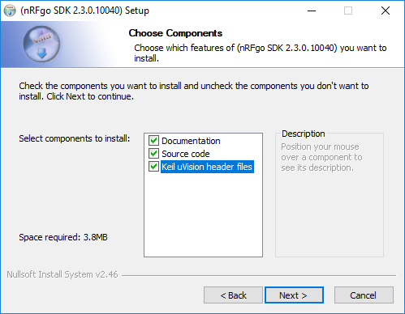

# NRF Tools
Ferramentas para programação dos transceptor nrf24le01, nrf24l01 e nrf24le1.

## Sobre os dispositivos

O NRF24LE1 é um transceptor de rádio frequência produzido pela [Nordic Semicondutors](www.nordicsemi.com). Este dispositivo é capaz de se comunicar na banda de frequência ISM (2.4 GHz) com taxas de transmissão em ar de até 2 MBits/s.

É importante notar as diferencias entre os módulos disponíveis no mercado, são eles:

* **nRF24LE1**: Módulo com microcontrolador 8051 integrado. Este módulo é composto pela antena nRF24LE01 e o microcontrolador 8051. Para programar este dispositivo é utilizado a IDE **Keil C51** e para gravar o código pode ser utilizado o **mPro** ou o [**gravador open-source**](https://github.com/italogfernandes/nrf24le1/releases) desenvolvido abaixo.

* **nRF24LE01**: Módulo para ser utilizado com o arduino ou outros microcontroladores. Possui duas principais versões no mercado:
  * NRF24L01 - Simples:
  
  * Com SNA e PA: Possui um amplificador e uma antena
  

## Instalando as Ferramentas

### NRF24L01 + Arduino DUE

1. Baixe o instalador para o seu sistema no link [Arduino - Download](https://www.arduino.cc/en/Main/Software).

 **Obs**: Caso utilize linux siga as instruções em: https://www.arduino.cc/en/Guide/Linux.
 Ou para Windows: https://www.arduino.cc/en/Guide/Windows

2. Instale a Placa Arduino Due na IDE.
  * Acesse: Ferramentas -> Placas -> Gerenciador de Placas.
  * Pesquise Arduino Due e instale a opção apresentada.

3. Após instalar o arduino, baixe os arquivos deste repositório (link)[https://github.com/italogfernandes/nrf24le1],
então coloque os arquivos de Arduino/libraries na pasta ´Arduino/libraries´ do seu sistema.

### NRF24L01 + STM32

1. Instale a IDE do arduino como descrito no passo 1 da sessão **NRF24L01 + Arduino DUE**.

2. Configure a IDE para programar o STM32.

3. Escreverei está parte mais tarde

### NRF24LE1 com Keil C51

1. Baixe e instale o **Keil C51**. Coloquei um tutorial a parte para este processo, tenha em mãos os meios de comprar uma licença do compilador caso você deseje fazer programas acima de 2 mil linhas. [Tutorial de Instalação do Keil C51](https://www.google.com/)

2. Baixe as bibliotecas fornecidas pela Nordic para o nRF24LE1, [nRFgo-SDK](http://www.nordicsemi.com/eng/Products/2.4GHz-RF/nRFgo-SDK).

3. Instale o nRFgo-SDK. (Next-> I Agree-> Selecione **Keil uVision header files** -> Next-> Install -> Aguarde a Instalação -> Next -> Finish)

### Instalação do Gravador do nRF24LE1

 Para instalar o gravador antes instale o Gtk#.
 O Gravador open source pode ser instalado a partir do anexo depositado no email.

1. Acesse o site de downloads do mono:  http://www.mono-project.com/download/stable/

2. Baixe o instalador: *GTK# for .NET* - Installer for running Gtk#-based applications on Microsoft .NET

3. Prossiga com a instalação até o final.                   

4. Após instalar, extraia o arquivo *WindowsRelease.rar* execute o arquivo *nrf-Burner*.

## Programando o NRF24L01 com o Arduino Due
1. Após instalar o keil, o GTK e o compilador_open_source podemos começar a escrever nosso código.
2. Por tanto, abriremos o nosso Keil com sua devida configuração (options target >> configurar output e C51) e criaremos então nosso primeiro projeto e salvaremos ele.

3. Com o projeto criado, o próximo passo é compilar e salvar o projeto em uma pasta. Nesta pasta estará uma outra pasta chamada objets e lá se encontra nosso arquivo .HEX de extrema importância.

4. o arquivo .HEX deve ser executado com o compilador_open_source para o arduino.

## Programando o NRF24LE1 com o Keil

## Exemplos de código

### Autores

* **Ítalo Fernandes** - github.com/italogfernandes
* **Talles Silva** - github.com/TallesSilva
