# Criando uma aplicação com o Keil C51

O *nRFgo Software Development Kit (SDK)* usado com o Keil C51 possibilita um modo flexível e simples para desenvolver usando um dispositivo nRF. Através desse guia você adquirir o conhecimento básico sobre como criar uma aplicação.

* Desenvolvimento usando nRFgo SDK
* Configurando o compilador Keil
* Iniciando com sua primeira aplicação

Baseado em  [[1]](http://www.nordicsemi.com/eng/nordic/download_resource/10885/7/38349113/1515).

## Pre-requisitos para este tutorial

**Software**
* Keil C51.
* nRFgo SDK.

**Hardware**
* nRF24LE1 e uma placa para conexão com a protoboard.
* Um gravador para o nRF24LE1.
* Alimentação de 3.3V.
* Led e resistor.

## Organização do nRFgo SDK
Este SDK é organizado em forma de árvore. Aqui uma pequena descrição das pastas mais importantes:

* \\Docs

Aqui fica a documentation do SDK.

* \\Precompiled files

Nesta pasta estão HEX files de projetos de exemplo. Não usaremos eles neste tutorial.

* \\Source code\\gazell

Gazell é uma biblioteca de link e pareamento para aplicações wireless. Não usaremos eles neste tutorial.

* **\\Source code\\hal**

É a abreviação para **Hardware Abstraction Layer (HAL)** contém as funções de interface gerais para começar a desenvolver rapidamente com os módulos que contém algum chip nRF. Usaremos algumas ou todos esses arquivos na maioria dos projetos. O caminho (*path*) destes arquivos precisa ser adicionado no seu projeto.

* **\\Source code\\lib**

As biblitoecas de interface com o HAL para funcionalidades mais específicas. Um exemplo disso é a funcionalidade a biblitoeca test RF que pode ser usada para configurar diferentes modos de teste.

* **\\Source code\\projects**

Uma pasta de projetos contendo exemplos que usam o SDK. O fabricante sugere que você salve seus projetos nesta pasta.

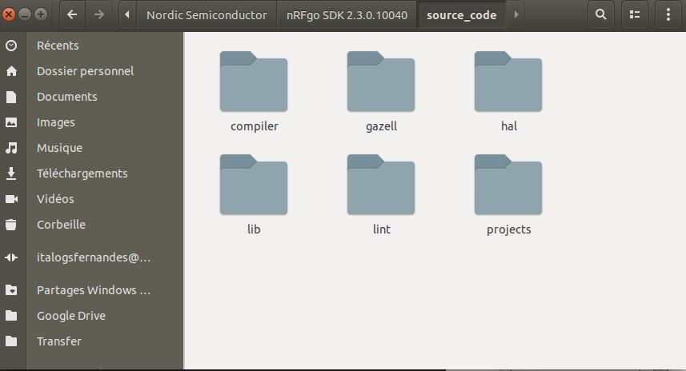

## Desenvolvendo com o nRFgo SDK

É possível dividir o processo de desenvolvimento com o nRFgo SDK em 4 passos. Esses passos, listados abaixo, vão desde a configuração do Keil até testar seu projeto.

1. Configurar seu projeto no Keil.
2. Escrever sua aplicação.
3. Inclusão de arquivos.
4. Testar seus projeto.

### Passo 1: Configurando seu projeto no Keil

Antes de escrever qualquer linha de código você precisa criar um novo projeto no qual você configurará o Keil para usar a dispositivo nRF que você possui (nRF24LE1) e incluir os caminhos para as biblitoecas que utilizará.

1. Inicie o Keil uVision através do menu do programas do Windows.
2. Logo após, selecione **Project, New uVision Project** no menu do Keil.
3. Selecione onde você deseja salvar seu novo projeto. Criarei uma pasta chamada "my_first_project" por exemplo.
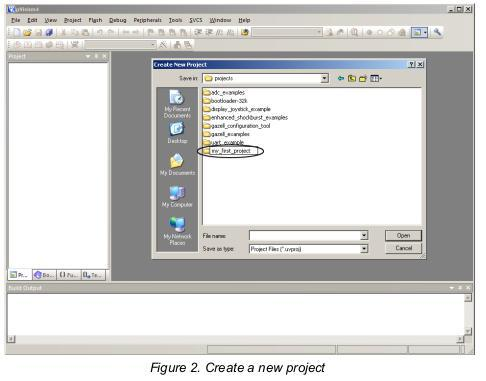
4. Crie a pasta e selecione **Save**.
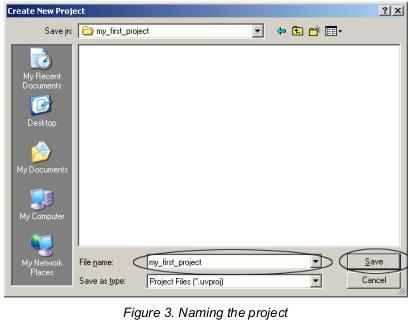
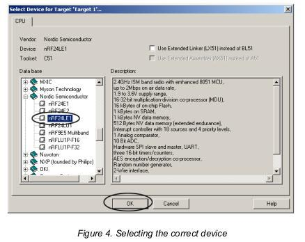
5. **Escolha do dispositivo**. No nosso projeto será o nRF24LE1. Se você está usando a versão completa do Keil você pode também utilizar a opção *Use Extended Linker/Assembler*. Entretanto para esse projeto não será necessário, está opção não é habilidade para a versão de avaliação do Keil.
6. Selecione *Ok*.
7. Selecione *No* quando perguntado para copiar o arquivo **Startdant 8051 Startup Code**. (Ele pode ser adicionado mais tarde, caso necessário)
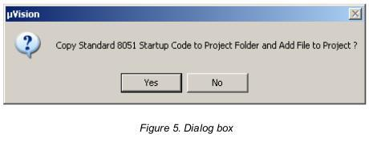
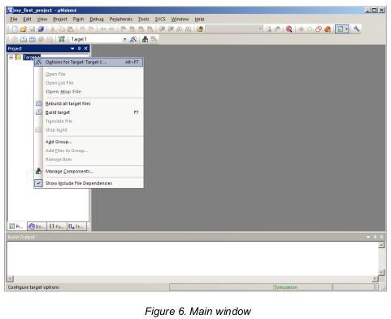
8. É preciso configurar o projeto antes de incluir arquivos e escrever seu código. Dê um clique com o botão direito em "*Target 1*" no área *Project tree view* e selecione **Options for Target** no menu que surgirá.
9. A figura 7 mostra uma captura de tela da aba "*Output*".
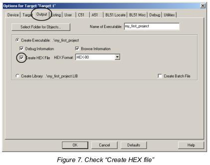
10. Marque a opção **Create HEX File**, para posteriormente gravar (*program*) o arquivo HEX gerado no seu dispositivo.
11. O proxímo passo é selecionar a aba "*C51*" e inicluir algumas pastas que serão utilizadas para encontrar os arquivos importados pelo seu código.
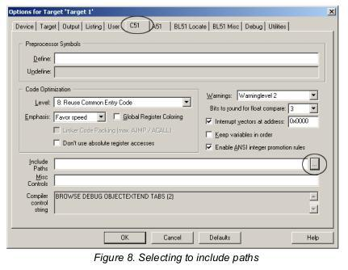
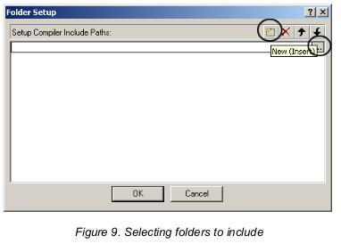
12. Por padrão nenhum caminho está incluido, então é necessário incluir 4 caminhos no projeto, utilizando a janela "*Folder setup*" (Figura 9).
13. Use os botões de inclusão para incluir todos os caminhos mostrados na Figura 10.
O caminho depende da versão do SDK, no meu caso :
    * c:\\Nordic Semiconductor\\nRFgo SDK 2.3.0.10040\\source_code\\hal
    * c:\\Nordic Semiconductor\\nRFgo SDK 2.3.0.10040\\source_code\\hal\\nrf24lu1p
    * c:\\Nordic Semiconductor\\nRFgo SDK 2.3.0.10040\\source_code\\hal\\nrf24le1
    * c:\\Nordic Semiconductor\\nRFgo SDK 2.3.0.10040\\source_code\\compiler\\common
14. A figura 10 mostra os caminhos que contém os arquivos necessários para este projeto.
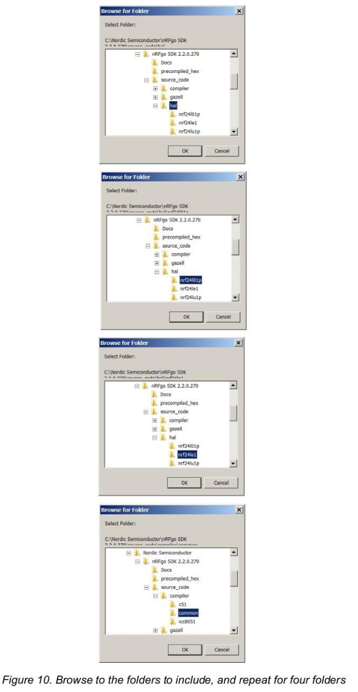
15. Após selecionar as pastas desejadas, confirme sua escolha selecionando **OK** na janela "*Browse for folder*".
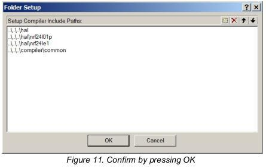
16. As pastas agora incluidas contêm todo os arquivos HAL que você usará para programar os modulos internos ao nRF24LE1. Se você está desenvolvendo com outro dispositivo, você precisará incluir os arquivos específicos para cada dispositivo. Todos dispositivos suportados pelo HAL tem suas próprias pastas. Selecione **OK** na janela "*Folder setup*" como mostrado na figura 11.
17. A figura 12 mostra o print da tela neste momento.
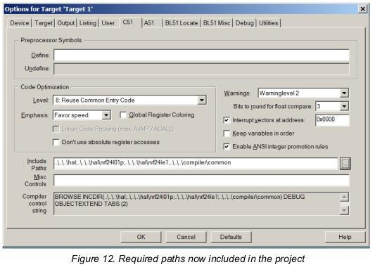
18. Se você estiver utilizando a opção "*extended Linker*" você pode escrever 'REMOVEUNUSED' no campo "*Misc controls*". Isso vai reduzir o espaço do codígo  removendo as funções não usadas durante a compilação. O nosso dispositivo tem uma memória bem pequena, portanto é importante estar atento a ao uso dela.
19. Quando você compila um projeto com funções que não foram usadas, uma mensagem de *warning* realacionada aparece. Ela não impedirá seu código de rodar mas é polui bastante a saída quando você compila algo, podendo atrapalhar o reconhecimento de erros. Para desabilitar esse *warning* você pode escrever '15, 16' no campo "*Disable warning numbers*". Veja a área circulada na figura 13.
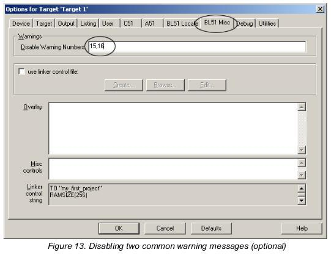
20. Clique no botão **OK** para confirmar as configurações do Keil.

Você completou o passo 1 do tutorial, agora o projeto está pronto para que você escreva seu primeiro código.

### Passo 2: Seu primeiro programa

O projeto agora está configurado e você pode começar a escrever as primeiras linhas do seu código para compilar e gravar este programa no nRF24LE1.
1. Antes de começar a escrever seu código você deve criar um arquivo vazio, vamos chamar de **main.c** e criar na pasta do projeto.
2. Na área *Project tree view*, clique com o botão direito sobre a pasta o grupo em que colocará seu arquivo e no menu selecione **Add files to group "application"**... como mostrado na figura 18. A janela "Add files to group 'application'" aparecerá. Caso os grupos não estejam com os mesmos nomes é possível renomeá-los na opção **Manage Components**, o seu código também funcionará com nomes diferentes.
3. Figura 18 e 19.
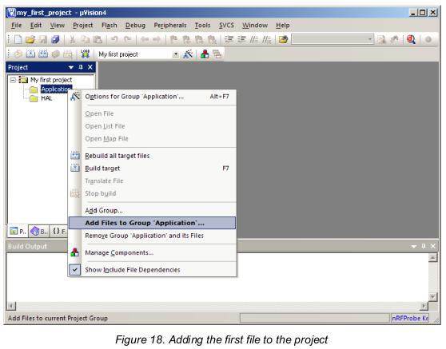
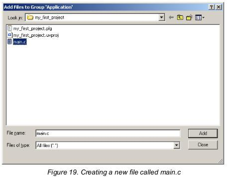
4. Crie um arquivo de texto clicando comm o botão direito na pasta *view* e escolhendo **New text document**, renomei-o para **main.c**. Veja a figura 19. Esse arquivo vai funcionar como um ponto de entrada para sua aplicação.
5. Clique duas vezes no arquivo main.c na área *Project tree view* para editá-lo.
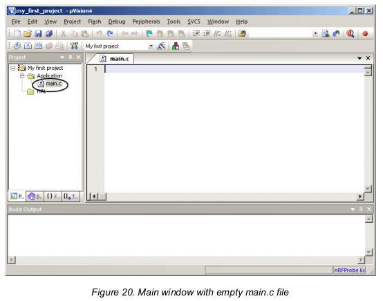
6. Adicione o arquivo vazio main.c para o projeto, escreva algumas linhas de código e compile-o.
7. Você pode copiar o código de exemplo abaixo.

```cpp
/* My first application */

#include<Nordic\reg24le1.h>

// Main routine
void main(){
    // Set P0 as Output
    P0DIR = 0x00;
    while(1){
        // Toggle a GPIO
        P00 = !P00;
    }
}
```
8. Este código de exemplo vai inverter o *Port 0 pin 0* continuamente.
9. Após escrever o código de exemplo no arquivo main.c você pode compilar o programa selecionando **Rebuild**. Veja a figura 22.
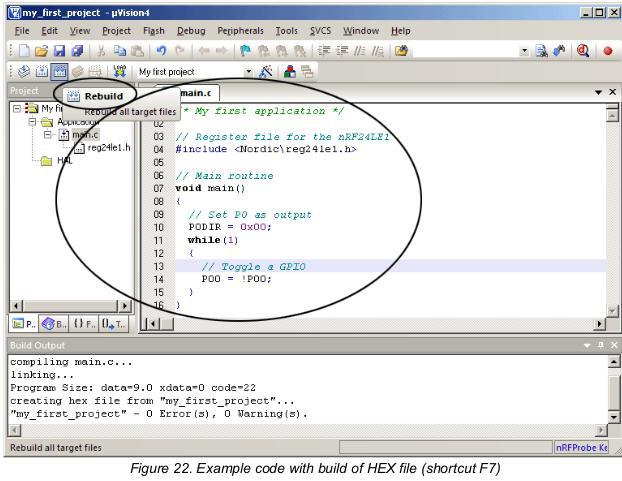
10. Após compilar o código você poderá gravá-lo no módulo nRF24LE1. Se você estiver utilizando o kit vendido pela nordik veja nas referências deste documento como fazer isso, caso esteja utilizando um módulo sozinho o processo de gravação de um código será abordado em outro artigo.

Neste ponto, você concluiu o passo 2 e criou com sucesso o seu arquivo HEX. Este arquivo contém as informações em linguagem de máquina que dizem todas as instruções que você programou.

### Passo 3: Incluindo Arquivos
Escrevendo códigos do zero pode ser cansativo e consumir muito tempo, já que será necessário estudar datalhes de todos os registradores no datasheet para configurar o dispositivo. Para agilizar o desenvolvimento existem modulos de software prontos para o uso que podem ser incluídos and re-usados para diversos projetos. Cada moulo contêm a funcionalidade para um específico modulo de hardware.

Você verá um exemplo de como adicionar o modulo do ADC (*Analog-to-digital-converter*) no nRF24LE1, para isso a biblioteca do ADC será incluída. Ao final disso, experimente adicionar a biblioteca de **delays**, ela será útil para o código **blink**.

1. Selecione a pasta HAL na área *Project tree view* e ative o menu de contexto clicando com o botão dinheiro. Selecione **Add Files to Group 'HAL'**. Veja a figura 25.
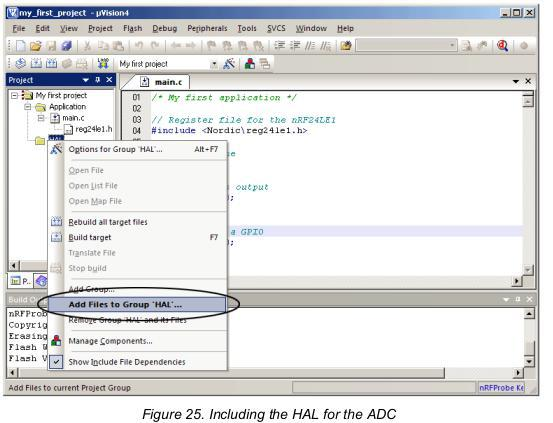
2. O HAL pode facilmente ser incluido clicando com o botão direito na pasta 'HAL' no área *Project tree view* e então selecionando "**Add the hal_adc.c**" para o projeto, como mostrado na figura 25 e 26.
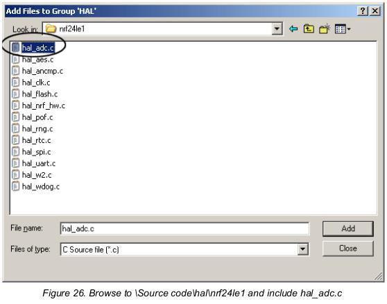
3. O HAL para o ADC agora está incluído no projeto, para fazer uso dela adicione no topo do arquivo main.c `#include<hal_adc.h>`. Veja a área circulada na figura 27.

4. Após incluir o arquivo no projeto você pode recompilar a aplicação (**Rebuild**). Veja a figura 27. Você pode usar um projeto com uma rotina main vazia. O espaço de código compilado agora pe de 191 bytes, a razão para isso é que você incluiu todas as funcionalidades do ADC para seu projeto, mesmo não fazendo uso das funções. Se você estiver usando o *extended linker*, então funções não usadas não são compiladas e não há aumento no espaço de código.
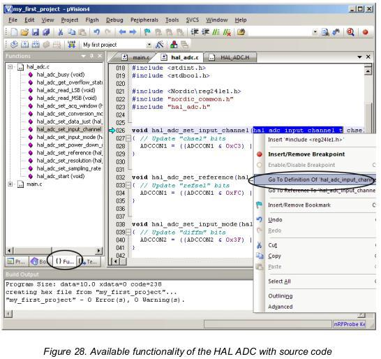
5. Opcionalmente você pode navegar pelas funções em hal_adc.c selecionando "Function tab". Veja a área circulada na figura 28. Clique em uma das funções para ver os argumentos e seu código fonte. Todos os parametros para as funções são *enumerators* que podem ser usados ao chamar a função.
6. Você pode também listar todos os enumeradores usando a opção de menu **Go To Definition of** (veja a figura 29).
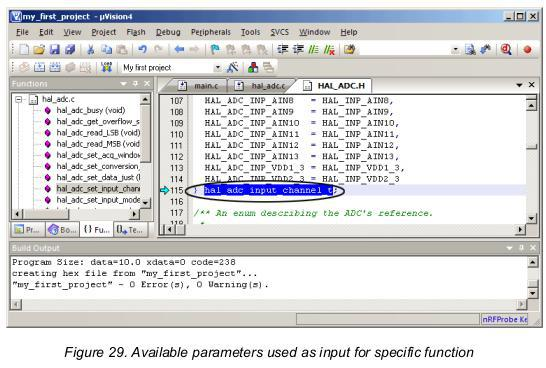
7. Usando as funções listadas em hal_adc.c você pode facilmente construir uma aplicação que inicializa e lê uma entrada analógica, evitando a necessidade de estudar o datasheet em detalhes. HAL similares a do ADC estão diponíveis para todos os modulos internos do nRF24LE1.
8. Por agora você pode copiar o conteúdo abaixo (Code example 2) na sua aplicação main.c.

```cpp
/* My first application */

#include<Nordic\reg24le1.h>

// Main routine
void main(){
    // Set P0 as Output
    P0DIR = 0x00;
    while(1){
        // Toggle a GPIO
        P00 = !P00;
    }
}
```
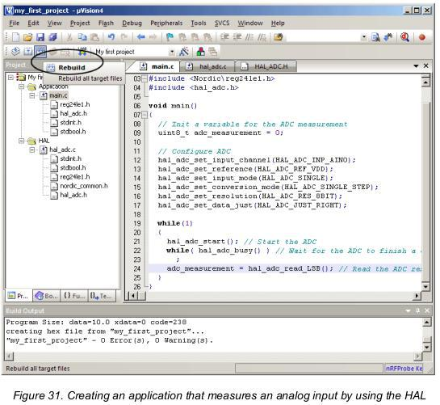
9. Após escrever o código em main.c, como mostrado na figura 31, use a opção **Rebuild** para recompilar o *target* e verificar se ocorreu tudo certo.
10. Neste ponto você incluiu com sucesso um módulo HAL. O HAL proporciona um fácil jeito de iniciar o uso de uma funcionalidade específica como o ADC.

## Conclusões
O nRFgo-SDK com o compilador Keil C51 proporciona um ambiente de uso facilitado para programar dispositivos nRF. Este SDK contêm o HAL, módulo de bibliotecas que podem ser usadas como estão ou serem consultadas em conjunto com o datasheet como referência para se escrever suas proprias rotinas (por exemplo escrever uma biblioteca para sensor inercial no nrf).
São vantagens de utilizar o nRFgo SDK:
* Modulos prontons que podem ser reutilizados em vários projetos.
* Códigos que alguém fez e testou para várias funcionalidades.
* Funções simples que facilitam o uso.
* Menor tempo de desenvolvimento.
* Flexibilidade de configurar o ambiente de desenvolvimento.

## Referências

1. Creating Applications with the Keil C51 C Compiler - [Acessar](http://www.nordicsemi.com/eng/nordic/download_resource/10885/7/38349113/1515). (Eu basicamente traduzi esse documento e selecionei as partes que são importantes e quais não são úteis para o nosso caso.)
2. Documentação do nRFgo SDK
3. Projetos de exemplo do nRFgo SDK
4. Documentação do nRFgo Starter Kit.
5. Documentação do nRFprobe.

[home](./)
