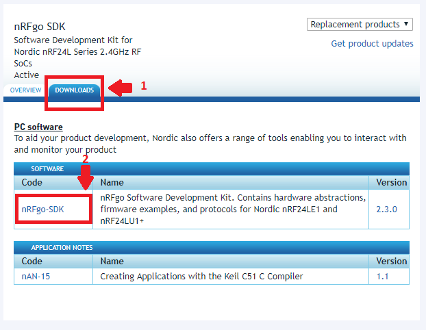

# NRF24LE1 com Keil C51

1. Baixe e instale o **Keil C51**. Coloquei um tutorial a parte para este processo, tenha em mãos os meios de comprar uma licença do compilador caso você deseje fazer programas acima de 2 mil linhas. [Tutorial de Instalação do Keil C51](https://docs.google.com/document/d/1W_Kswk1_rQaXbn979NydRj2gIEgyFtQWS1OaIG-DneA/edit?usp=sharing) - [Vídeo](https://www.youtube.com/watch?v=xSqIlKJOs6A).

2. Baixe as bibliotecas fornecidas pela Nordic para o nRF24LE1, [nRFgo-SDK](http://www.nordicsemi.com/eng/Products/2.4GHz-RF/nRFgo-SDK).

3. Instale o nRFgo-SDK. (Next-> I Agree-> Selecione **Keil uVision header files** -> Next-> Install -> Aguarde a Instalação -> Next -> Finish)

[voltar](./instalacao.html)
